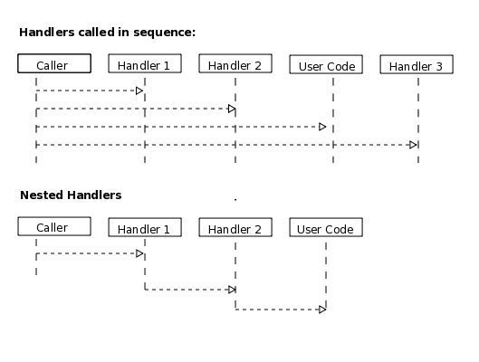
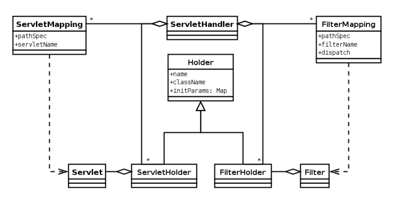

jetty的重要组件图

1. Connector 连接器
2. Server 服务器
3. ThreadPool 线程池
4. Handler 处理器

## Connector
连接器的主要作用用于接受连接，同时接受来自远程节点的数据，以及允许应用程序发送数据给远程节点。
前提条件是，连接器设置了需要的处理器进行这些任务的处理。

1. 连接器接受TCP连接
2. 连接器请求连接工厂创建一个连接对象，用来处理TCP连接的网络拥堵，解析和生成特定协议的字节流
Connector --> ConnectionFactory --> Connection --> Read/Write bytes

## Server
服务器的主要作用是聚合连接器和请求的处理者

## ThreadPool
线程池用于接受服务器发送的任务并处理，在jetty中线程池是对java原生的接口的拓展，增加了一些报告方法和配置方法

## Handler

处理器就是接受外部的HTTP请求。
1. 处理器直接生成HTTP响应
2. 将请求进行修改和检查，并传递下去
3. 将请求传递给一个或者多个处理集合

处理器类别：
1. 处理器顺序执行
2. 处理器嵌套执行

### ServletHandler
ServletHandler是一种通过把request传递给指定配置的Servlet Filters以及Servlet Mapping，然后生成内容的处理器。

### Contexts
上下文就是将特定URI路径下的处理器在概念上汇集。

1. 上下文路径，用来定义那些请求属于该上下文
2. 资源基地址，用来处理静态内容
3. 类加载器用来处理特定的上下文（/WEB-INF/classes 和 /WEB-INF/lib）
4. 虚拟主机名称

### WebApplication
一个Web应用上下文是一个继承ServletContextHandler，同时支持标准化的Web布局，以及通过Web.xml来对Session, security,
listeners, filter, servlets 和 jsp.

