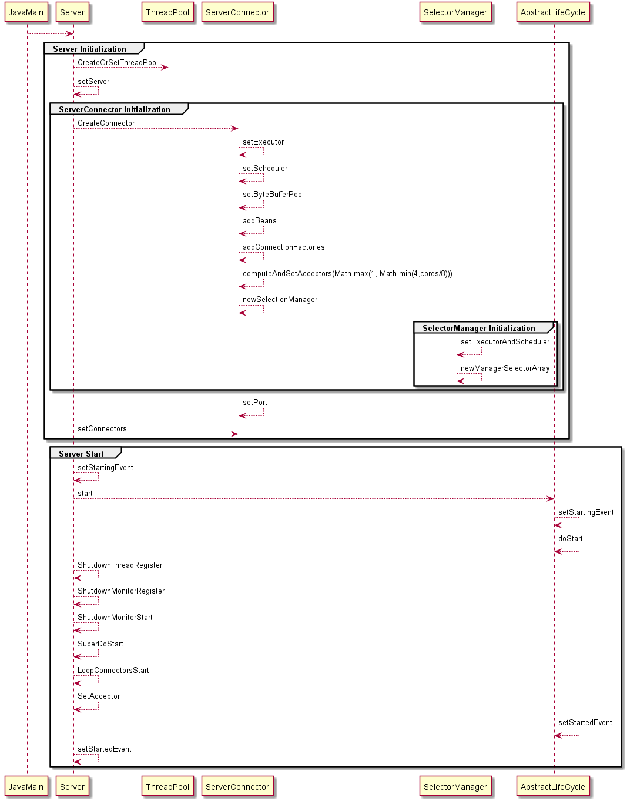

## jetty 主体流程

Server作为jetty中整体结构的聚合者，和其他组件进行交互的过程如下：

ServerConnector
1. 设置线程池
2. 设置调度器
3. 设置字节缓冲池
4. 添加连接工厂
5. 计算并设置接受者的数量
6. 创建selector数组，由生命周期钩子触发具体selector创建的过程

Server Start
1. 关闭线程注册与启动
2. 将Server中的Connectors进行启动
3. 设置接受者（具体地处理请求）
4. 触发启动事件

