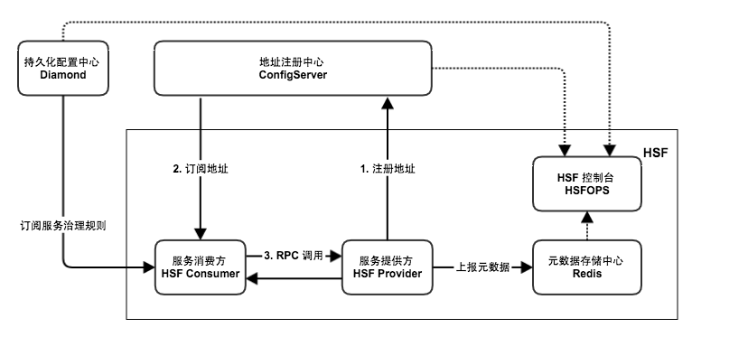

产品架构
HSF 作为一个纯客户端架构的 RPC 框架，本身是没有服务端集群的，所有的 HSF 服务调用都是服务消费方（Consumer）与服务提供方（Provider）点对点进行的。然而，为了实现整套分布式服务体系，HSF 还需要依赖以下外部系统。

HSF 架构

地址注册中心
HSF 依赖注册中心进行服务发现，如果没有注册中心，HSF只能完成简单的点对点调用。因为作为服务提供端，没有办法将自己的服务信息对外发布，让外界知晓；作为服务消费端，可能已经知道需要调用的服务，但是无法获取能够提供这些服务的机器。而注册中心就是服务信息的中介，提供服务发现的能力。

在阿里巴巴集团内部，地址注册中心的角色是由 ConfigServer 承担的。

持久化配置中心
持久化的配置中心用于存储 HSF 服务的各种治理规则，HSF 客户端在启动的过程中会向持久化配置中心订阅各种服务治理规则，如路由规则、归组规则、权重规则等，从而根据规则对调用过程的选址逻辑进行干预。

在阿里巴巴集团内部，持久化配置中心的角色是由 Diamond 承担的。

元数据存储中心
元数据是指 HSF 服务对应的方法列表以及参数结构等信息，元数据不会对 HSF 的调用过程产生影响，因此元数据存储中心也并不是必须的。但考虑到服务运维的便捷性，HSF客户端在启动时会将元数据上报到元数据存储中心，以便提供给服务运维使用。

在阿里巴巴集团内部，元数据存储中心的角色是由 Redis 承担的。

HSF 控制台
HSF 控制台通过打通地址注册中心 ConfigServer、持久化配置中心 Diamond、元数据存储中心 Redis，为用户提供了一些列服务运维功能，包括服务查询、服务治理规则管理、服务测试、服务 Mock、单机运维等，旨在提高 HSF 服务研发的效率、运维的便捷性。

在阿里巴巴集团内部，HSF 控制台的角色是由 HSFOPS 承担的。

产品功能
HSF 作为分布式 RPC 服务框架，支持多种服务的调用方式。

同步调用
HSF客户端默认以同步调用的方式消费服务，客户端代码需要同步等待返回结果。

异步调用
对于服务调用的客户端来说，并不是所有的 HSF 服务都需要同步等待返回结果的。对于这些服务，HSF 提供异步调用的形式，让客户端不必同步阻塞在 HSF 调用操作上。HSF 的异步调用，有 2 种：

Future 调用：客户端在需要获取调用的返回结果时，通过 HSFResponseFuture.getResponse(int timeout) 主动获取结果。
Callback 调用：Callback 调用利用 HSF 内部提供的回调机制，当指定的 HSF 服务消费完毕拿到返回结果时，HSF 框架会回调用户实现的 HSFResponseCallback 接口，客户端通过回调通知的方式获取结果。
泛化调用
对于一般的 HSF 调用来说，HSF 客户端需要依赖服务的二方包，通过依赖二方包中的 API 进行编程调用，获取返回结果。而泛化调用是指不需要依赖服务的二方包，从而发起 HSF 调用、获取返回结果的方式。在一些平台型的产品中，泛化调用的方式可以有效减少平台型产品的二方包依赖，实现系统的轻量级运行。

HTTP 调用
HSF 支持将服务以 HTTP 的形式暴露出来，从而支持非 Java 语言的客户端以 HTTP 协议进行服务调用。

调用链路 Filter 扩展
HSF 内部设计了调用过滤器，并且能够主动发现用户的调用过滤器扩展点，将其集成到 HSF 调用链路中，使扩展方能够方便的对 HSF 请求进行扩展处理。

产品优势
高性能的网络通信
在网络通信层面，HSF 采用开源的高性能、异步事件驱动的 NIO 框架 Netty 作为网络通信框架。
在协议层面，HSF 2.x 做了大量优化，使用了更适用于 RPC 场景的 RPCRemoting 协议替换了 HSF 1.x 中的 TBRemoting 协议，性能有了大幅提高。目前，HSF 在物理机上的压测数据约为 30w QPS。
无入侵的代理服务
HSF 利用了 Java 语言的代理机制，将协议封装、选址、远程调用等一系列 RPC 逻辑进行了封装，对用户透明。用户在使用 HSF 进行远程服务调用时，只需要进行简单的 Spring 配置，就可以专注于自己的业务逻辑，编码方式与本地调用没有任何区别。

强大的服务管控
HSF 配套的控制台（HSFOPS）提供了丰富的服务管控功能，例如：

服务查询：提供多种维度的服务查询功能，展示服务的实时状态。
服务治理：提供多种服务治理规则的管理功能，如路由规则、归组规则、同机房规则、权重规则等，让用户通过配置服务治理规则，完成服务集群的管理、流量的划分。
服务测试：提供快速测试、调用服务的能力，用户只需通过在页面上输入服务调用的参数，即可方便的完成一次 HSF 服务的调用，提升研发效率。
服务 Mock：提供 HSF 服务的 Mock 能力，使用时无需关注服务端是否存在，只需要在 HSFOPS 上配置好 Mock 规则，HSF 客户端即可通过 hsf-mock 插件获取配置的 Mock 数据，并且对代码没有入侵。
应用场景
HSF 诞生于阿里巴巴内部诸多系统进行服务化改造的诉求，也就是说 HSF 本身就是对应用服务化进行支撑的框架。一般意义上，一个公司的业务系统发展脉络基本都是类似的：从单个应用到多个应用，从本地调用到远程调用，随着发展需要对远程服务进行高效的资源管理，这个过程中，RPC框架解决了主要的技术问题。

因此，如果你希望自己的应用可以进行服务化改造，将单个巨型应用拆分成多个职责分明的基础服务应用，进而将这些基础服务提供给更多上层应用使用，那么，HSF 将会是你最佳的选择。