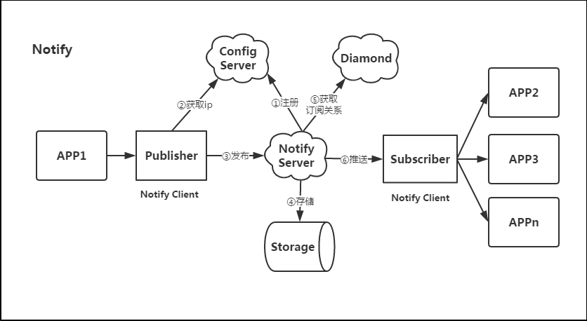
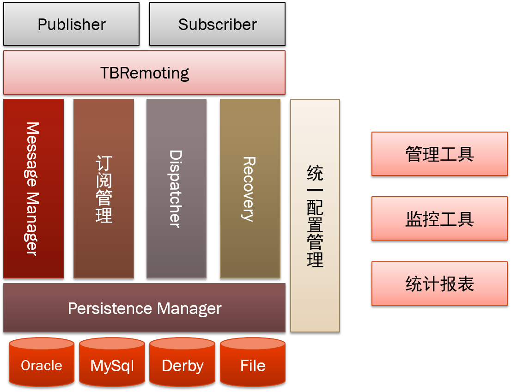

## notify

* NotifyServer注册到ConfigServer中，把NotifyServer中的IP地址存储上去。
* Publisher上线，从ConfigServer中获取NotifyServer地址列表并向NotifyServer推送某个(些)主题消息。
* Subscriber上线，从ConfigServer中获取NotifyServer地址列表，并向NotifyServer订阅感兴趣的主题。
* NotifyServer将订阅关系存储到Diamond，等待消息到来。
* NotifyServer接收到消息后，先将消息存储到Storage，再从Diamond中查找订阅关系。将消息推送到订阅了该主题的机器上。

* 消息可能重复投递
* 消息不保证有序
* 集群模式
* 拓展性好
* 分布式事务的支持

消息的服务质量QOS
exactly once
at least once
at most once

消息的发送到消费
1. 发布消息
2. 消息转储
3. 消息消费

都可能出现消息丢失，要保证可靠投递，则需要重复地投递消息

